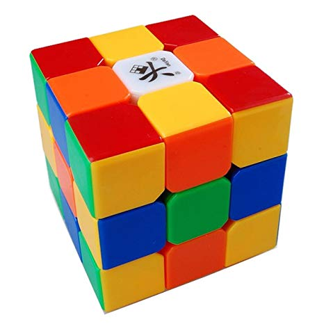
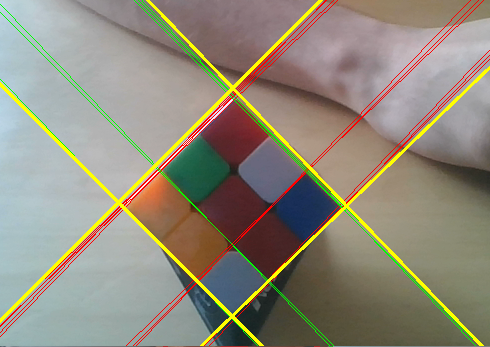
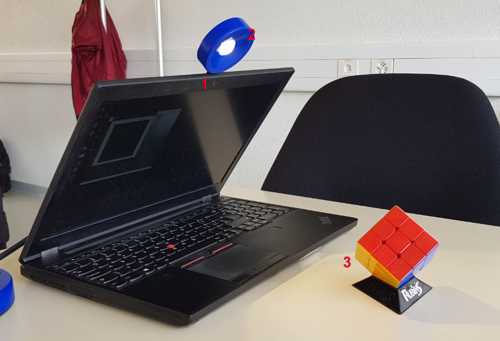
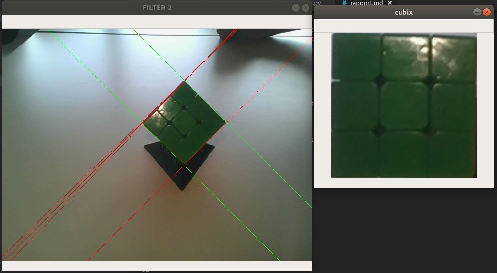

\newpage

\tableofcontents

\newpage

# Introduction

# Configuration d'exécution

Pour la bonne exécution du programme, il vous installer le matériel **dans** la manière optimale.

## Matérielle nécessaire

- Caméra
- Rubik's cube
- _Optionnel :_ Lampe

La lampe permet d'avoir un meilleur résultat pour la détection de la position du cube et la détection des couleurs.

Le but de ce projet était la réalisation d'une application permettant la détection d'un rubik's cube, sa reconnaissance ainsi que sa résolution avec affiche de celui-ci à travers un model 3D. Ce projet a été réalisé dans le cadre du cours "Traitemen d'image" à la He-Arc.

# Configuration du programme

Ce programme nécessite un certain nombre de package python. Nous avons utilisé un `venv` durant le dévelopement afin de faciliter l'intallation. Le fichier `requirements.txt` contient la liste des dépendances, pour créer le venv et installer celles-ci sur un système linux, vous pouvez executer les lignes de commandes suivantes.

```sh
virtualenv -p python3 venv
. venv/bin/activate
pip install -r requirements.txt
```

En ce qui concerne les dépendances externes, il est nécessaire d'installer la bibliothèque:

- kociemba

Installable de la manière suivante :

```sh
sudo apt install kociemba
```

# Fonctionnement et Architecture

Ce projet a été séparé en 5 étapes distinctes qui sont les suivantes:

1. Détection d'une face du rubik's cube
2. Reconnaissance des couleurs de la face
3. Reconstruction du rubik's cube valide à partir des 6 faces scannées dans n'importe quel ordre
4. Résolution du rubik's cube
5. Affichage du rubik's cube en 3D

## Détection d'une face du rubik's cube

Cette étape consistait à identifier l'emplacement d'une face du Rubik's cube dans une image et à l'extraire.

De nombreuses techniques existent notemment en recherchant une grille de 9 carrés. Cette technique est applicable pour les rubik's cube originaux dont chaque cube d'une facette est séparée par une bande de couleur noir comme sur l'image ci-dessous:

{ width=70% }

N'ayant disposition que des rubik's cube ou plus exactement des "Speed cube" sans bordure noire entre les faces comme sur l'images ci-dessous:

{ width=70% }

Il était dès lors beaucoup plus difficile de pouvoir détecter directement chaque carré composant une face du cube. La solution que nous avons trouvée et développée par du constat que la propriété principale du cube est il qu'il est composé de simples lignes. Ainsi l'idée a été d'effectuée une transformation de Hough et de trouver l'ensemble de lignes parralèles et perpendiculaires le plus représenté.

Une fois ces lignes identifiées, nous prenons les lignes les plus à l'extérieur, ce qui nous donne par exemple les lignes en jaune sur l'image suivantes:

{ width=70% }

Nous pouvons ensuite extraire le carré centrale construit par ces 4 lignes pour extraire la face du rubik's cube.

## Reconnaissance des couleurs d'une face

En premier on va découper l'image transformée en 9 parties (3x3) et on va encore réduire de quelques pixels sur les bords pour ne pas avoir les déchets du bord du rubiks cube. Ensuite on va faire une opération mathématique sur l'ensemble des pixels pour récupérer une seule couleur plutôt qu'une image 2 dimenssions.

L'opération mathématique est très simple à changer car on peut la passer en paramètre de la méthode. Nous avons essayé avec une médiane et une moyenne, et la moyenne est plus adapté à notre cas d'utilisation.

Pour la reconnaissance des couleurs, nous sommes parties sur une base d'un article comparant les différents type de représentation de couleur disponibles [@Couleurs]. Ensuite nous avons fait des tests pour voir quelle valeur correspondait avec quelle type de couleur.

Et nous sommes arrivés à ce résultat : 

Couleur     Condition RGB       Condition HSV
-------     ----------------    --------------   
**bleu**    -                   90 < H < 120
**blanc**   Ecart type < 40     -
**orange**  -                   H < 15 
**rouge**   G < 48              H < 190
**jaune**   G > 50              10 < H < 30
**vert**    -                   60 < H < 90

## Reconstruction du rubik's cube

Les deux étapes précédentes permettant d'isoler chaque face et de reconnaitre leurs différentes couleurs, l'étape suivante était de remettre dans l'ordres les différentes faces du cube afin que celui-ci soit valide.

Cette étape consistait en deux points essentiels:

1. Détecter si l'ensemble des faces permettaient de reconstruire un rubik's cube valide
2. Reconstruire le rubik's cube

Lors du développement nous avons écris nos propres tests afin de tester si le cube était valide notemment en comptant le nombre de couleurs totales mais celà ne suffisait pas alors nous avons décider d'utiliser la bibliothèque `kociemba` permettant de valider si un rubik's cube était valide.

Une fois la possibilité de pouvoir tester si un rubik's cube était valide, il nous restait à trouver comment agencer les différentes faces.

Après un certains nombre de tests avec la bibliothèque pour vérifier la validité du cube, nous nous sommes rendu compte que cette méthode était extrêmement rapide et que le meilleur moyen de trouver la bonne configuration était de proposer chaque solution à notre fonction.

Cette opération peut paraître conteuse mais le nombre de cas à tester est très petit: `4*4*4*4*4*4 = 5096`. Ce calcul découle du fait que le point central de chaque face ne bouge jamais et donc que nous savons quelles faces sont adjacentes. Il ne nous reste plus qu'à tester le composition des 4 rotations possibibles de chaque faces. Tester ces 4096 possibilités est extrêment rapide et dès que la solution est trouvée, le processus s'arrête. Il n'existe qu'une seule possibilité d'assemblage des différentes faces pour chaque cube. Le seul cas ou on peut avoir plusieurs faces valides est lorsque une face du rubik's cube est uniforme ou lorsqu'elle est symétrique.

## Résolution du rubik's cube

La résolution du rubik's n'a pas étée développée par nos soins car ce travail n'était pas le point central du projet. Nous avons utilisé l'algporithme de Kociemba afin d'effectuer cette étape.

Le code nécessaire a cette partie est relativement simple et est le suivant:

```python
import kociemba
solution = kociemba.solve(cube)
```

La variable cube étant une string définissant l'état du cube par exemple:

- `BBRUUUUDFBRUURRBBDLFFFFFRFBDLFDDDFDDLBDLLLRLRLBUUBRURL`.

## Affichage du rubik's cube en 3D

L'affichage du cube a été developpée à l'aide de la bibliothèque python "ModernGL". Celle-ci permet de faire du rendu à l'aide d'OpenGL.

Le rubik's cube est décomposé en 81 petits cubes qui sont déplacés à l'aide de la matrice de translation.
Ensuite, lorsqu'une rotation est effectuée sur une face du rubik's cube, on applique une matrice de rotation pour chaque cube de cette face.
Le fait d'effectuer la translation puis la rotation, cela veut dire que le centre de rotation d'un cube est en fait le centre de rotation du rubik's.
Cela simplifie le positionnement des cubes dans l'espace lors des rotations des faces.

Pour garder la trace de chaque cube au bon endroit, un tableau avec 3 dimensions est utilisé.
Une fois qu'une rotation est effectuée sur l'affichage, le tableau de cubes est mis à jour afin de correspondre aux nouvelles positions de chaque cube tournée.

Au tout début de l'application, le rubik's cube est construit sous sa forme résolue. On effectue les rotations inverses de la solution (qui est obtenue par la phase précédente, c'est-à-dire la résolution) afin d'obtenir le cube mélangé. On utilise ensuite la solution pour que l'utilisateur puisse voir les différentes rotations permettant la résolution.

Concernant l'aspect graphique du cube, chaque petit cube comporte les 6 couleurs du rubik's cube. Les couleurs sont définies lors de la création du cube en lui même (tableau de couleurs passé aux shaders). Les bords noirs du cube sont fait dans le fragment shader. Pour cela, on regarde simplement quelle est la position dans la face du cube que nous sommes en train de traiter. Si cette position est proche d'un bord on affiche du noir, sinon on affiche la couleur correspondante à la face dans le tableau de couleurs passé au préalable.

# Utilisation

La première chose a faire est d'installer le setup pour reconnaitre le rubik's cube. Nous avons testé notre programme avec ce setup :



Les 3 éléments importants sont :

1. Une caméra (ici, webcam de l'ordinateur)
2. Une lampe
3. Le rubik's cube face à la caméra

Il est très important que le rubik's cube soit face à la caméra. Il faut aussi que le rubik's cube soit sur une surface plane sans ligne droit (bord de portable ou bord de table).

Pour utiliser le programme, il faut lancer le script `rubik_cv.py` avec python. Pour ça on va utiliser l'environment virtuel python qui a été paramètré précédemment.

```sh
. venv/bin/activate
python rubik_cv.py
```

Une fois le programme lancé, deux fenêtre vont s'ouvrir, une de la caméra avec les lignes Hough et une avec l'image transformée. Il faut positionner le cube pour avoir une image transformée stable comme ceci : 



Après cela, il faut appuyer sur la touche d du clavier. On peut voir les couleurs scannées sur l'écran de la console.

Une fois les 6 faces scannées, on peut voir la simulation 3D du rubik's cube s'affiché. On peut voir chaqué étape en appuyant sur les flèches du clavier et faire des rotations avec la souris.

# Résultats

# Améliorations

Le programme actuelle est fonctionnelle mais l'efficacité serait grandement meilleure avec quelques améliorations.

## Reconnaissance des couleurs 

Idéalement, il faudrait reconnaitre les images avec un algorithme type machine learning de clustering, comme vu dans le cours d'IA. Cela permettrait d'identifier les 6 couleurs sans avoir à ce soucier des différentes valeurs.  

## Identification des faces du rubik's cube

La méthode utilisée fonctionne très bien mais nécessite d'avoir un arrière-plan uniforme.

- TODO: Améliorations partie Bastien

## Affichage du rubik's cube

TODO: Malik petit text

- Ajouter une animation de rotation des faces sur le cube en 3D
- Ajouter une slider pour naviguer dans la ...TODO:

# Conclusion

\newpage

\listoffigures

# References
